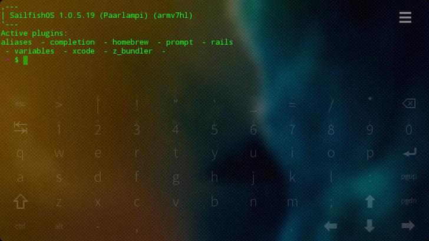
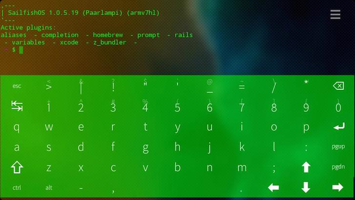

# fingerterm

fingerterm is a terminal emulator designed for touch-based interaction,
specifically for (but not limited to) use on the Nokia N9 and Jolla's
Jolla device.

#UI tweaks for fingerterm

fingerterm is the Terminal application that ships with Sailfish OS on the [Jolla smartphone](http://jolla.com). This fork contains a few UI tweaks that improve fingerterm's appearance and usability. 

###Usability improvements
- Removed the spacing between keys on the virtual keyboard to maximize key sizes. 
- Reduced the opacity of the keyboard when inactive to make it easier to read text obscured by the inactive keyboard.
- Pressing an arrow key, the Page Up / Page Down key or the space key doesn't activate the keyboard anymore (but the key press is otherwise processed normally). This makes it easier to, for example, navigate long documents in vim. You can now scroll through a long document using the arrow keys or the Page Up / Page Down key without causing the keyboard to activate and cover most of the screen. 
- Disabled auto-repeat for alpha-numeric and special character keys and allow swiping from one key to the next (like the built-in keyboard) to facilitate correcting tapping mistakes.
- You can now disable the virtual keyboard auto-hide feature by sliding the the "VKB delay" slider in the settings all the way to the right.
- Better, smoother scrolling when "Drag mode" is set to "Scroll" in Terminal's settings.
- Unset the POSIXLY_CORRECT environment variable on startup as [having it set causes bash to start in POSIX mode](http://www.delorie.com/gnu/docs/bash/bashref_62.html#IDX214) which causes it to [not read the .bashrc on startup](http://lists.gnu.org/archive/html/bug-bash/2001-10/msg00117.html)

###Cosmetic changes
- Made default font and virtual keyboard green.
- Made the window background translucent.
- Added a cover (full credit to [Thomas Perl](https://github.com/tph) for this code)

##Known issues
Several of these changes required the use of Sailfish OS-specific components. This fork will therefore only run on Sailfish OS (i.e. on the Jolla). 

##Build instructions

###If you're a Qt / Sailfish OS veteran

- Disable "Shadow build" in Qt Creator's Build Settings for both the arm and the i486 build settings as the fingerterm.spec file assumes that fingerterm.pro will be found in the build directory.
- To run fingerterm in the Sailfish emulator, you'll need to add the `qt-components-qt5` and `qt5-qtdeclarative-import-xmllistmodel` packages to the i486 target.

###If you're new to Qt and Sailfish OS development

1) Download and install the [Sailfish SDK](https://sailfishos.org/develop.html). As mentioned in the instructions, make sure you have VirtualBox installed first.

2) Follow [this tutorial](https://sailfishos.org/develop-firstapp-article.html) to create and run a HelloWorld application. Make sure that you can build and run the app in the emulator and on your device.

3) Clone this repo:

    git clone https://github.com/mehdime/fingerterm.git
    
4) Launch Qt Creator and open the project file (fingerterm.pro).

5) Qt Creator will prompt you to configure the project. Select both the arm and the i486 configurations with their default settings.

6) Select the `Projects` tab on the left-hand side and deselect "Shadow build" for both the arm and the i486 build settings. When shadow build is enabled, Qt Creator will run the build in a folder separate from the project's folder. This is generally a good idea especially if you're building for multiple platforms as each platform will then have its own build folder containing its own build artifacts. But in the case of fingerterm, the fingerterm.spec file, which contains packaging instructions, assumes that the build will be done in the project folder. So shadow build would cause build errors.

7) If you want to run fingerterm on your device, you should now be able to just build and run! 

8) To run it in the emulator, you'll first have to add the `qt-components-qt5` and `qt5-qtdeclarative-import-xmllistmodel` packages to the emulator as they are required by fingerterm to run. So click the `SailfishOS` tab on the left-hand side and click "manage" for the i486 target. Enter `qt-components-qt5` in the input field and click "install". Do the same for `qt5-qtdeclarative-import-xmllistmodel`.

9) When switching between building for your device and building for the emulator, you must first clean your project folder from build artifacts. Otherwise, the new build will fail when the linker tries to link objects files built for different platforms together. Git does a good job at making sure that your project folder is pristine clean (make sure that you understand what this command does before you run it however. It might delete files you didn't intend to delete):

    git clean -fdx
    
##Reverting to the stock Terminal app

The version of fingerterm that ships as the Terminal app on Jolla is the one from the `master` branch on [nemomobile's GitHub repository](https://github.com/nemomobile/fingerterm). This is where this repo was forked from. You can build that version using the instructions above.

You should also try [Thomas Perl](https://github.com/thp)'s port of fingerterm to Silica in the `silica` branch of the nemomobile repo. It's not yet complete but worth a try.

